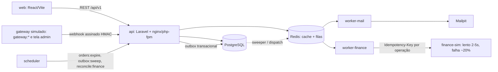
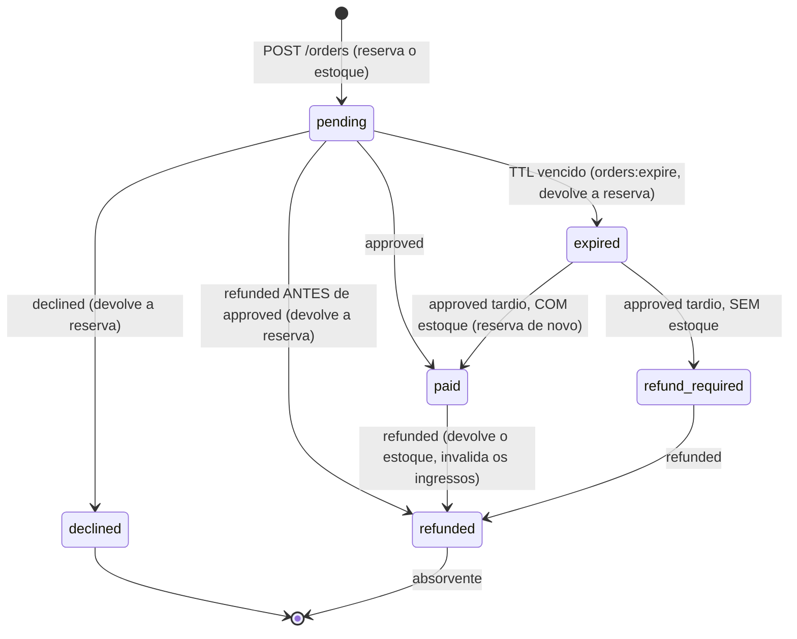

# Sistema de Venda de Ingressos — Codificar (Desafio Técnico Full Stack)

Venda de ingressos em lotes limitados, pensada para o dia em que milhares de pessoas compram no mesmo minuto.
Cada problema relatado pelo cliente (P1 a P7) virou um requisito, um mecanismo e um teste (tabela abaixo).

> **Estado de validação:** a API, os workers, o scheduler, o Mailpit e o finance-sim foram executados de verdade
> (sem Docker) e a suíte da API e a do front passam. **O `docker compose` não pôde ser executado** no ambiente em que o
> trabalho foi feito. Veja [“O que não foi validado”](#o-que-não-foi-validado) e `AUDITORIA.md`.

## Sumário
[Arquitetura](#arquitetura) · [Escolhas](#por-que-estas-escolhas) · [Como subir](#como-subir) · [Testes](#testes) ·
[Simular o gateway](#simular-os-avisos-do-gateway-itens-42-e-44) · [Operação](#comandos-operacionais) ·
[P1 a P7](#problemas-do-cliente--mecanismo--teste) · [Estados](#máquina-de-estados-do-pedido) ·
[E-mail](#política-de-e-mail-pelo-menos-uma-vez) · [Capacidade](#capacidade-dos-workers) ·
[Bibliotecas](#bibliotecas-externas) · [Trade-offs](#trade-offs-e-limitações) · [Não validado](#o-que-não-foi-validado)

## Arquitetura



Projetos separados: `api/` (Laravel), `web/` (React) e `finance-sim/` (PHP mínimo + SQLite que faz o papel do
financeiro do cliente).

## Por que estas escolhas

- **Laravel 11 + PHP 8.4**: é a stack da Codificar; traz filas, scheduler, validação, Sanctum e testes. O PHP 8.4 é
  exigido porque o `composer.lock` fixa Symfony 8 (todo o repositório e o Docker usam 8.4).
- **PostgreSQL**: a garantia contra overselling é do banco, não da aplicação: `UPDATE ... WHERE total - reserved - sold >= q`
  atômico + `CHECK (reserved + sold <= total)`. Chaves primárias/únicas fazem de mutex para idempotência e dedupe.
- **Redis**: cache do painel (`Cache::flexible`), rate limit e transporte das filas `mail` e `finance`.
- **Outbox transacional**: o webhook só muda o estado e grava jobs em `outbox_jobs` (mesma transação) e responde em
  milissegundos (o gateway reenvia após 3 s). Os efeitos pesados (PDF, e-mail, financeiro) rodam em workers, com retry
  e backoff. A tabela é a fonte da verdade, e o Redis é só transporte (se cair, o sweeper recupera).
- **Idempotência em camadas**: compra por `Idempotency-Key` (+ hash canônico do corpo); aviso do gateway por
  `payment_events.event_id` (PK); jobs por `UNIQUE(order_id, kind)`; e-mails por `email_deliveries`; financeiro por
  `Idempotency-Key` própria de cada operação.
- **Comprador sem login; admin com e-mail e senha (Sanctum)**: `POST /orders` é público; o UUID do pedido é o segredo
  de acesso ao `GET /orders/{id}` (nunca devolve o documento, e-mail mascarado). Painel e simulador exigem admin
  (401 sem token, 403 para autenticado sem role admin). Não há cadastro público.
- **Painel por contadores do lote**: nunca faz `COUNT` em `orders`; custo O(nº de lotes), com cache de ~1 s e
  `ETag`/304. O front faz polling com jitter (não usa SSE: cada conexão presa ocuparia um worker do php-fpm).

## Como subir

Pré-requisitos: Docker + Docker Compose v2 e `make`. (Sem Docker: PHP 8.4 com `pdo_pgsql`, `gd`, `mbstring`, `intl`,
`bcmath`, `zip`; Composer; Node 22; Postgres 16; Redis 7; Mailpit.)

```bash
make setup     # copia api/.env.example -> api/.env (com APP_KEY de DEV) e web/.env.example -> web/.env
make up        # docker compose up --build -d  (migrate + seed rodam só no container api)
```

| Serviço | URL |
|---|---|
| Site (vitrine/checkout) | http://localhost:5173 |
| Admin (login) | http://localhost:5173/login — `admin@codificar.dev` / `password` (**somente dev**) |
| Painel / Simulador | http://localhost:5173/admin/dashboard · http://localhost:5173/admin/gateway |
| API | http://localhost:8000/api/v1 (contrato em `api/docs/openapi.yaml`) |
| Mailpit | http://localhost:8025 |
| finance-sim | http://localhost:8080/sales |

Detalhes que importam:
- **`api/.env` é o único arquivo de ambiente**; todos os containers PHP o leem (mesma `APP_KEY` em api, workers e scheduler).
  A `APP_KEY` do `.env.example` é **só de desenvolvimento**; em produção gere outra (`php artisan key:generate --show`).
- Só o container `api` roda `migrate`/`seed` e `storage:link`; workers e scheduler esperam o healthcheck
  (`/api/v1/readyz`) ficar saudável. Todos os processos PHP rodam como `www-data`.
- O seed (idempotente) cria o evento **Festival BH 2026** com tipos *Pista* e *Camarote*: **lote de exatamente 50
  ingressos** (Pista) e outro de 200 (Camarote), mais o admin.
- Criar outro admin: `make admin EMAIL=ana@codificar.dev NAME=Ana PASSWORD=senha-forte` (ou
  `php artisan admin:create {email} {--name=} {--password=}`).
- Para ver a expiração rapidamente, reduza `RESERVATION_TTL_MINUTES` (padrão 15) em `api/.env` e reinicie os containers.
- `make down` apaga os volumes (`down -v`).

## Testes

```bash
make test-api          # Pest: Unit + Feature + Concurrency (banco ticketing_test)
make test-concurrency  # só a suíte com processos reais
make test-web          # Vitest + typecheck
make lint              # Pint --test
```

- Os testes usam o banco **`ticketing_test`** (criado por `docker/postgres-init/`; em volume antigo use `make test-db`).
  O `phpunit.xml` **força** `DB_DATABASE=ticketing_test` e o `TestCase` se recusa a rodar em qualquer banco que não
  termine em `_test`, então o banco de desenvolvimento nunca é apagado.
- **Concorrência real** (`tests/Concurrency`): 30 processos PHP, cada um com a sua conexão, disparam 300 compras em
  um lote de 50 (commits reais, barreira de início sincronizada). Resultado exigido: exatamente 50 pedidos, 250
  `sold_out`, `reserved + sold <= total`. Também cobre a mesma `Idempotency-Key` em 20 processos e o mesmo aviso do
  gateway em 20 processos. (Removendo a condição de estoque do `UPDATE`, o T1 falha: verificado por mutação.)
- Os demais testes ficam em `tests/Feature` e `tests/Unit` (Pest). O CI (`.github/workflows/ci.yml`) roda Pint, Pest
  (com Postgres e Redis como services) e, no front, typecheck, Vitest e build.

## Simular os avisos do gateway (itens 4.2 e 4.4)

O simulador assina o corpo (HMAC-SHA256, `GATEWAY_WEBHOOK_SECRET`) e chama o webhook por HTTP real. Comandos (dentro
do container: `docker compose exec api php artisan ...`) e a tela `/admin/gateway` fazem o mesmo:

| Comportamento | Comando | O que prova |
|---|---|---|
| Aprovar / recusar / reembolsar | `gateway:approve {order}` · `gateway:decline {order}` · `gateway:refund {order}` | fluxo normal |
| **4.2(a)** mesmo aviso repetido | `gateway:duplicate {order} --times=5` | mesmo `event_id` em paralelo: 1 emissão, 2 e-mails, 1 registro financeiro |
| **4.2(b)** fora de ordem | `gateway:out-of-order {order}` | `refunded` chega antes do `approved` (mais antigo): fica `refunded`, sem ingressos/e-mails |
| **4.2(c)** reenvio por lentidão | `gateway:retry-on-timeout {order}` | o gateway desiste da resposta (timeout de 1 ms) e **reenvia o mesmo `event_id` na hora**, em paralelo: processa uma vez |

Para obter um `order_id`: faça uma compra no site (o id aparece em `/orders/{id}`) ou
`curl -X POST localhost:8000/api/v1/orders -H 'Idempotency-Key: demo-1' -H 'Content-Type: application/json' -d '{"batch_id":1,"quantity":2,"buyer":{"name":"Maria","email":"maria@example.com","document":"52998224725"}}'`.
(`document` é um CPF válido de teste; os ids dos lotes: `GET /api/v1/events/1/batches`.)

## Comandos operacionais

| Comando | Para quê |
|---|---|
| `orders:expire` | Expira pedidos `pending` vencidos e devolve a reserva ao lote (uma vez por pedido). Agendado a cada minuto. |
| `outbox:sweep` | Reenfileira jobs perdidos (Redis caiu) ou travados (`running` com lock vencido). A cada 30 s. |
| `outbox:retry {--kind=} {--order=} {--all-failed}` | Recoloca jobs `failed` em `pending` (zera as tentativas) e despacha. O painel mostra a contagem de `failed`. |
| `reconcile:finance` | Compara pedidos pagos com o que o finance-sim registrou (faltantes/duplicadas). A cada 5 min. |
| `admin:create {email} {--name=} {--password=}` | Cria ou atualiza um admin. |
| `loadtest:storm {--batch=} {--buyers=} {--concurrency=} {--pollers=}` | Compras simultâneas + pollers do painel, com latência por requisição. `make loadtest`. |

## Problemas do cliente → mecanismo → teste

| # | Problema | Mecanismo | Testes que provam |
|---|---|---|---|
| P1 | Site travando na compra | A compra é uma transação curta; o webhook só grava estado + outbox; e-mail/PDF/financeiro vão para workers | `WebhookTest` (nada de e-mail, PDF ou financeiro na request), `loadtest:storm` |
| P2 | Overselling | `UPDATE` atômico com a condição de estoque + `CHECK (reserved + sold <= total)` + lote inativo não vende | `Concurrency/OversellingTest` (T1), `CreateOrderTest` |
| P3 | Pedido duplicado | `Idempotency-Key` (PK + hash canônico do corpo); no front, guarda síncrona contra clique duplo e chave reaproveitada | `CreateOrderTest`, `Concurrency` (T2), `web/tests/checkout.test.tsx` |
| P4 | E-mail 3 vezes | Dedupe do aviso por `event_id`; `UNIQUE(order_id, kind)` no outbox; `email_deliveries` só vale com `sent_at`; Message-ID determinístico | `WebhookTest` (T3), `PostPaymentTest` (T7), `Concurrency` (T3) |
| P5 | Reembolsado aparecendo como pago | Máquina de estados com `REFUNDED` absorvente (vale mesmo se o `approved` chegar depois) | `OutOfOrderEventsTest`, `OrderStateMachineMatrixTest`, `RefundTest` |
| P6 | Financeiro: vendas em dobro/ausentes | `Idempotency-Key` por operação (`{order}:sale`, `{order}:refund`), outbox com retry + backoff, sweeper, `outbox:retry`, reconciliação | `PostPaymentTest`, `RefundTest` |
| P7 | Painel lento | Só contadores do lote (nunca `COUNT` em `orders`) + cache de ~1 s + ETag/304 + polling com jitter | `DashboardTest`, `loadtest:storm` |

## Máquina de estados do pedido



**Avisos fora de ordem ou repetidos** (tabela completa, coberta por `OutOfOrderEventsTest` e `OrderStateMachineMatrixTest`):

| Estado atual | `approved` | `declined` | `refunded` |
|---|---|---|---|
| `pending` | → `paid` (emite ingressos, enfileira e-mails + financeiro) | → `declined` | → `refunded` (devolve a reserva; um `approved` posterior é ignorado) |
| `paid` | ignorado | ignorado | → `refunded` |
| `declined` | ignorado | ignorado | evento registrado, **estado não muda** (pagamento nunca confirmado) |
| `expired` | **com estoque** → `paid`; **sem estoque** → `refund_required` | ignorado | evento registrado, **estado não muda** |
| `refund_required` | ignorado | ignorado | → `refunded` |
| `refunded` | ignorado | ignorado | ignorado |

Em todos os casos o mesmo `event_id` repetido não tem efeito algum.

**Reembolso e financeiro (corrida venda x estorno):** se a venda já foi enviada (`running`/`done`) ou já foi tentada
(`pending` com `attempts > 0`, pois o financeiro pode ter gravado e a resposta se perdido), cria-se o job de estorno
(`{order}:refund`), que só executa depois que a venda estiver registrada (enquanto isso reagenda sem gastar tentativas).
Venda `pending` nunca tentada é apenas cancelada. E-mails pendentes são cancelados.

## Política de e-mail: “pelo menos uma vez”

Cada e-mail (comprovante, ingressos) é um job do outbox. A linha de `email_deliveries` é criada antes da tentativa
**com `sent_at` nulo** e só vale como “enviado” quando o SMTP confirma. Se o SMTP cair, o retry reenvia (a venda não fica
sem comprovante); se já foi enviado, pula. Trade-off: é **pelo menos uma vez**, não “no máximo uma”. A janela residual é a
falha entre o envio e a gravação de `sent_at` (worker morto nesse instante): o e-mail seria reenviado com o **mesmo
Message-ID** (`{order_id}.{kind}@...`), o que mitiga a duplicidade visível. Esta janela é pequena e foi preferida a perder um
comprovante, que viola o item 5.4.

## Capacidade dos workers

O finance-sim leva 2 a 5 s (média ~3,5 s) por chamada e falha ~20% (~1,25 tentativa por venda): ~17 chamadas/min por
worker, ou ~14 vendas/min. O padrão são **4** `worker-finance` (~55 vendas/min) e **2** `worker-mail`. Na abertura
a fila do financeiro cresce e drena depois; isso não bloqueia compra, e-mail nem painel (filas separadas).
Escale com `FINANCE_WORKERS=8 MAIL_WORKERS=4 make up`. O timeout HTTP do financeiro (10 s) é menor que o
`timeout` do job (60 s), que é menor que o `retry_after` da fila (90 s). Os workers reiniciam sozinhos
(`restart: unless-stopped`, `--max-time=3600`).

## Evidência da validação ponta a ponta (execução local, sem Docker)

Executado em PHP 8.4.26, Postgres 16, Redis 7 e Mailpit 1.21.8, com 2 workers de e-mail, 4 de financeiro e o scheduler:

- Compra **sem login** → 201; mesma chave → 200 + `Idempotent-Replay`; mesma chave com corpo diferente → 422.
- `gateway:approve`: pedido `paid`; **2 e-mails no Mailpit** (comprovante e ingressos com PDF de 2 páginas e 2 QR);
  venda no finance-sim com chave `{order}:sale`.
- `gateway:duplicate --times=5` e `gateway:retry-on-timeout`: nenhum efeito extra (2 tickets, 3 jobs, 2 e-mails).
- `gateway:refund`: `refunded`, ingressos `invalidated`, estoque devolvido uma vez, estorno `{order}:refund` registrado.
- `gateway:out-of-order`: `refunded`, 0 tickets, 0 jobs, 0 e-mails.
- Pedido não pago com TTL de 1 min: o scheduler o expirou sozinho e a disponibilidade voltou.
- finance-sim e Mailpit parados durante a aprovação: jobs ficaram `pending` com retries (e-mail com `sent_at` nulo);
  ao religar, concluíram com **exatamente 2 e-mails e 1 linha financeira**.
- Admin: sem token 401; login errado 422; admin 200; usuário não admin 403 (dashboard, simulador e eventos); `/register` e
  `/me/orders` 404.
- Carga (`loadtest:storm`, 600 compras em ondas de 30 + 30 pollers do painel, lote de 200): **200 criados, 26 replays
  idempotentes, 374 × 409, zero overselling**. Latência por requisição sem contenção: painel p50 19 ms / p95 26 ms,
  compra p50 25 ms / p95 32 ms. Sob contenção, compra p50 483 ms / p95 918 ms (sem pollers: 474 / 808 ms) e painel
  p50 1,0 s / p95 1,26 s. **Ressalva:** isso foi no servidor embutido do PHP com 12 workers (não nginx + php-fpm) e
  os 60 pedidos simultâneos por onda formam fila nele; as latências absolutas não representam produção.

## Bibliotecas externas

**API (Composer):** `laravel/framework` 11, `laravel/sanctum` (auth do admin), `barryvdh/laravel-dompdf` (PDF),
`endroid/qr-code` 5 (QR Code), `predis/predis` (Redis); dev: `pestphp/pest` + plugin Laravel, `laravel/pint`,
`mockery/mockery`, `fakerphp/faker`, `larastan/larastan`.
**Web (npm):** `react`, `react-router-dom`, `@tanstack/react-query`, `react-hook-form`, `zod`, `@hookform/resolvers`,
`tailwindcss` (framework CSS), `vite`, `typescript`, `vitest`, `@testing-library/*`, `msw`, `openapi-typescript`,
`openapi-fetch`. **Infra:** PostgreSQL 16, Redis 7, Mailpit, nginx, php-fpm.

## Trade-offs e limitações

- **E-mail “pelo menos uma vez”** (ver acima).
- **Pagamento tardio**: se o pedido expirou e o estoque foi vendido a outro, o pagamento
  vira `refund_required` (o estorno em si não é automatizado, só sinalizado).
- **`orders.user_id` existe mas é opcional e não é usado** (comprador sem conta). `GET /orders/{id}` é público por UUID:
  quem tiver o link vê status, lote, quantidade, total e e-mail mascarado.
- **Rate limit de compra por IP** é configurável (`ORDERS_RATE_LIMIT_PER_MINUTE`, 0 desliga, e desligado nos
  testes e no loadtest); atrás de NAT corporativo pode ser conservador.
- **O CRUD admin de eventos/lotes** foi mantido, mas sem investimento: só há smoke test.
- **Sanctum** atualiza `last_used_at` do token nas requisições autenticadas; com ~30 pollers isso são escritas na mesma
  linha. Não foi perfilado; se aparecer, o caminho é um guard sem escrita para o painel.
- **Sem testes de navegador (Playwright/Cypress):** o front é coberto por Vitest (checkout, auth, simulador) e pelo
  contrato OpenAPI tipado, não por E2E.
- O simulador de gateway só existe com `ENABLE_DEV_TOOLS=true` (desligue fora de dev).

